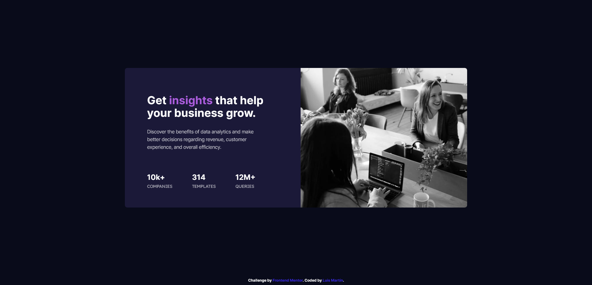

# Frontend Mentor - Stats preview card component solution

This is a solution to the [Stats preview card component challenge on Frontend Mentor](https://www.frontendmentor.io/challenges/stats-preview-card-component-8JqbgoU62). Frontend Mentor challenges help you improve your coding skills by building realistic projects.

## Table of contents

- [Overview](#overview)
  - [The challenge](#the-challenge)
  - [Screenshot](#screenshot)
  - [Links](#links)
- [My process](#my-process)
  - [Built with](#built-with)
- [Author](#author)

## Overview

### The challenge

Users should be able to:

- View the optimal layout depending on their device's screen size

### Screenshot

### Links

- Live Site URL: [https://stats-preview-card-delta.vercel.app/](https://https://stats-preview-card-delta.vercel.app/)

## My process

### Built with

- Semantic HTML5 markup
- CSS custom properties
- Flexbox
- BEM methodology
- Mobile-first workflow

## Author

- Website - [Luis Martin](https://github.com/roguesquid)
- Frontend Mentor - [@roguesquid](https://www.frontendmentor.io/profile/roguesquid)
- Twitter - [@roguesquid26](https://www.twitter.com/roguesquid26)
